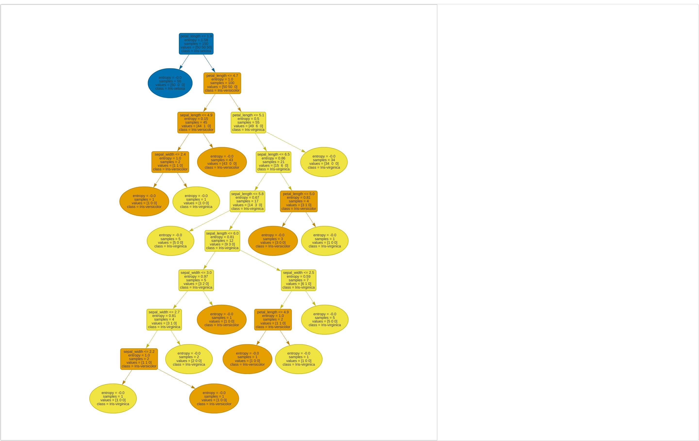

# Iris species classification using decision trees

In this project we solve the classification of the different iris species (Schwertlilien) using decision trees.
 

Which leads to the following result:

